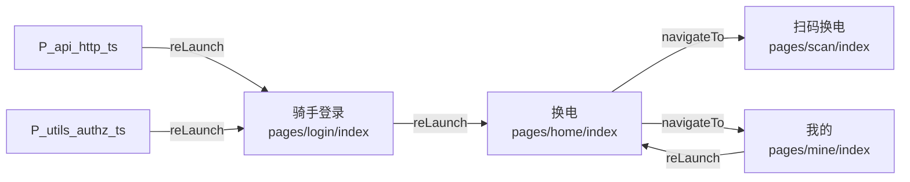

# 骑手端页面流转

> 本文件由 `node mini/tools/gen-page-flow.mjs` 从 `pages.json` 与页面源码生成，**不要手工编辑**。
> 手画的流转图一旦和代码分叉就再没人信它，所以宁可脚本生成、偶尔过期，也不手写。

## 图

## 页面清单

| 页面 | 标题 | 入口 |
|---|---|---|
| `pages/login/index` | 骑手登录 | **启动页** |
| `pages/home/index` | 换电 |  |
| `pages/scan/index` | 扫码换电 |  |
| `pages/mine/index` | 我的 |  |

## 跳转边

| 从 | 到 | API | 语义 | 位置 |
|---|---|---|---|---|
| `api/http.ts` | `pages/login/index` | reLaunch | 重启到（清空栈） | api/http.ts:107 |
| `pages/home/index` | `pages/scan/index` | navigateTo | 进入（可返回） | pages/home/index:19 |
| `pages/home/index` | `pages/mine/index` | navigateTo | 进入（可返回） | pages/home/index:23 |
| `pages/login/index` | `pages/home/index` | reLaunch | 重启到（清空栈） | pages/login/index:18 |
| `pages/mine/index` | `pages/home/index` | reLaunch | 重启到（清空栈） | pages/mine/index:16 |
| `utils/authz.ts` | `pages/login/index` | reLaunch | 重启到（清空栈） | utils/authz.ts:13 |

## 说明

- 未注册的跳转目标会被 --check 拦下；标题来源：`pages.json` 的 `navigationBarTitleText`（共 4 页）。
- 小程序端没有 vue-router，鉴权拦在各页面 `onShow` 的 `ensureAuthenticated()` 与后端每个接口的 `hasRole('RIDER')` 两处；
  凭证失效由请求层 `clearTokensAndRelaunch()` 直接 `reLaunch` 到登录页（用 reLaunch 是为了清掉整条页面栈，
  否则用户按返回会再撞一次 401）。
